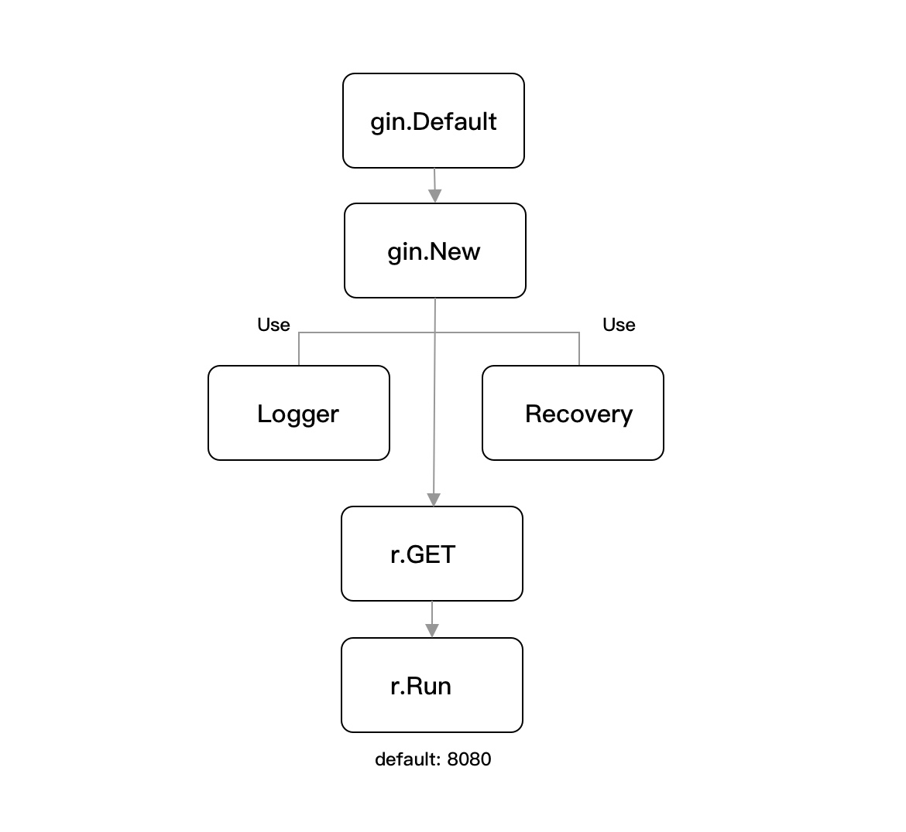

# 开启博客之路

本次博客项目选用gin框架完成开发



```
func Default() *Engine {
	debugPrintWARNINGDefault()
	engine := New()
	engine.Use(Logger(), Recovery())
	return engine
}
```

首先调用`gin.Default`方法来创建默认的Engine实例，它会在初始化阶段就引入Logger和Recovery中间件，能够保障应用程序的最基本运作

- Logger:输出请求日志，并标准化日志的格式
- Recovery：异常捕获，也就是针对每次请求处理进行recovery处理，防止因为出现panic导致服务崩溃，并同时标准化异常日志的格式

```
func New() *Engine {
	debugPrintWARNINGNew()
	engine := &Engine{
		RouterGroup: RouterGroup{
			Handlers: nil,
			basePath: "/",
			root:     true,
		},
		FuncMap:                template.FuncMap{},
		RedirectTrailingSlash:  true,
		RedirectFixedPath:      false,
		HandleMethodNotAllowed: false,
		ForwardedByClientIP:    true,
		AppEngine:              defaultAppEngine,
		UseRawPath:             false,
		UnescapePathValues:     true,
		MaxMultipartMemory:     defaultMultipartMemory,
		trees:                  make(methodTrees, 0, 9),
		delims:                 render.Delims{Left: "{{", Right: "}}"},
		secureJsonPrefix:       "while(1);",
	}
	engine.RouterGroup.engine = engine
	engine.pool.New = func() interface{} {
		return engine.allocateContext()
	}
	return engine
}
```

- RouterGroup:路由组，所有的路由规则都由 *RouterGroup 所属的方法进行管理，在 gin 中和 Engine 实例形成一个重要的关联组件
- RedirectTrailingSlash：是否自动重定向，如果启用了，在无法匹配当前路由的情况下，则自动重定向到带有或不带斜杠的处理程序去
- RedirectFixedPath：是否尝试修复当前请求路径，也就是在开启的情况下，gin 会尽可能的帮你找到一个相似的路由规则并在内部重定向过去，主要是对当前的请求路径进行格式清除（删除多余的斜杠）和不区分大小写的路由查找等。
- HandleMethodNotAllowed：判断当前路由是否允许调用其他方法，如果当前请求无法路由，则返回 Method Not Allowed（HTTP Code 405）的响应结果。如果无法路由，也不支持重定向其他方法，则交由 NotFound Hander 进行处理。
- ForwardedByClientIP：如果开启，则尽可能的返回真实的客户端 IP，先从 X-Forwarded-For 取值，如果没有再从 X-Real-Ip。
- UseRawPath：如果开启，则会使用 url.RawPath 来获取请求参数，不开启则还是按 url.Path 去获取。
- UnescapePathValues：是否对路径值进行转义处理。
- MaxMultipartMemory：相对应 `http.Request ParseMultipartForm` 方法，用于控制最大的文件上传大小。
- trees：多个压缩字典树（Radix Tree），每个树都对应着一种 HTTP Method。你可以理解为，每当你添加一个新路由规则时，就会往 HTTP Method 对应的那个树里新增一个 node 节点，以此形成关联关系。
- delims：用于 HTML 模板的左右定界符。

总的来讲，Engine实例就像引擎一样，与整个应用的运行、路由、对象、模板等管理和调度都有关联，另外通过上述的解析，你可以发现其实 gin 在初始化默认已经替我们做了很多事情，可以说是既定了一些默认运行基础。

```
func (group *RouterGroup) handle(httpMethod, relativePath string, handlers HandlersChain) IRoutes {
	absolutePath := group.calculateAbsolutePath(relativePath)
	handlers = group.combineHandlers(handlers)
	group.engine.addRoute(httpMethod, absolutePath, handlers)
	return group.returnObj()
}
```

GET方法来将定义的路由注册进去

- 计算路由的绝对路径
- 合并现有和新注册的Handler，并创建一个函数链`HandlersChain`
- 将当前注册的路由规则（含 HTTP Method、Path、Handlers）追加到对应的树中

```
func (engine *Engine) Run(addr ...string) (err error) {
	defer func() { debugPrintError(err) }()

	address := resolveAddress(addr)
	debugPrint("Listening and serving HTTP on %s\n", address)
	err = http.ListenAndServe(address, engine)
	return
}
```

Run会通过解析地址，再调用`http.ListenAndServe`将实例作为`Handler`注册进去，然后启动服务，开始对外提供HTTP服务

接下来在下面的小节中，我们就可以根据 RESTful API 的基本规范，针对我们的业务模块设计路由规则，从业务角度来划分多个管理接口

1. 标签管理

- 新增标签
- 删除指定标签
- 更新指定标签
- 获取标签列表

2. 文章管理

- 新增文章
- 删除指定文章
- 更新指定文章
- 获取指定文章
- 获取文章列表

