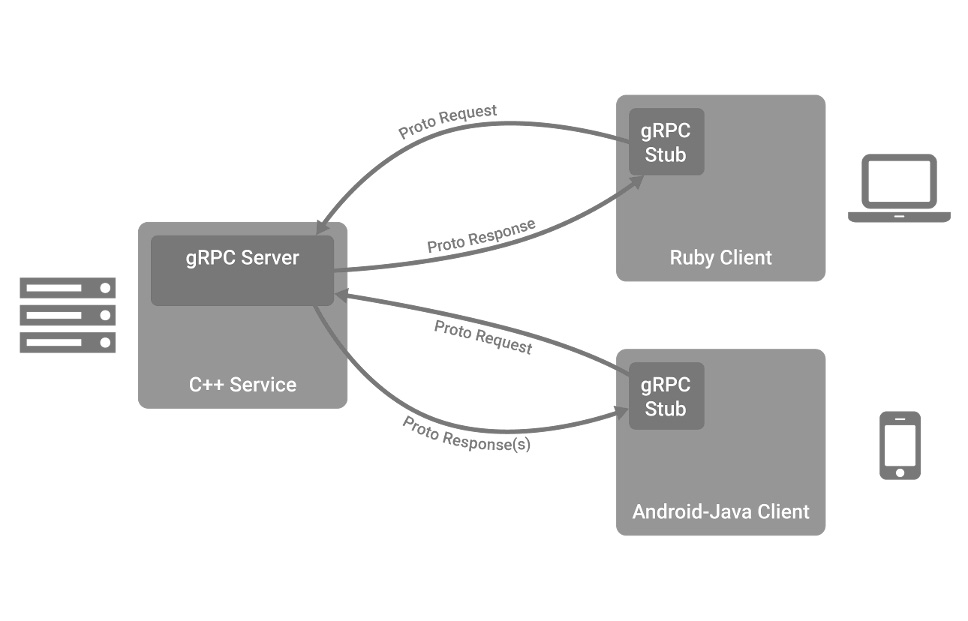

# 遨游 gRPC 和 Protobuf

上一个章节，介绍了使用GO语言的gin框架做一个基于HTTP服务的Web项目，接下来，介绍Go语言中最流行的RPC框架：gRPC,并探索其相对应的技术栈

## RPC

RPC代指远程过程调用，它的调用包含了传输协议和编码（对象序列）协议等等，允许运行于一台计算机的程序调用另一台计算机的子程序，而开发人员无需额外地 为这个交互作用编程，因为我们称RPC调用，就像在进行本地函数调用一样方便

## gRPC

gRPC是一个高性能、开源和通用的RPC框架，面向移动和基于HTTP/2设计。目前提供C、Java和Go语言等等版本。

gRPC基于HTTP/2标准设计，带来诸如双向流、流控、头部压缩、单TCP连接上的多复用请求等特性。这些特性使得其在移动设备上表现更好，在一定的情况下更节省空间占用。

gRPC 的接口描述语言（Interface description language，缩写 IDL）使用的是 Protobuf，都是由 Google 开源的。

## gRPC调用模型

1. 客户端在程序中调用某方法，发起RPC调用。
2. 对请求信息使用Protobuf进行对象序列化压缩（IDL）
3. 服务端接收到请求后，解码请求体，进行业务逻辑处理并返回
4. 对响应结果使用Protobuf进行对象序列化压缩（IDL）
5. 客户端接收到服务端响应，解码请求体。回调被调用的A方法，唤醒正在等待响应（阻塞）的客户端调用并返回响应结果

## Protobuf

Protocol Buffers是一种与语言、平台无关、可扩展的序列化结构化数据的数据描述语言，常称其为IDL，常用于通信协议，数据存储等等，相较于JSON、XML，它更小、更快，因此更受开发人员的喜爱

## gRPC优势

### 性能

gRPC使用的IDL是Protobuf，Protobuf在客户端和服务端上都能快速地进行序列化，并且序列化后的结果较小，能够有效地节省传输占用的数据大小。另外众多周知，gRPC 是基于 HTTP/2 协议进行设计的，有非常显著的优势。

另外常常会有人问，为什么是 Protobuf，为什么 gRPC 不用 JSON、XML 这类 IDL 呢，我想主要有如下原因：

- 在定义上更简单，更明了
- 数据描述文件只需原来的1/10至1/3
- 解析速度是原来的20倍至100倍
- 减少了二义性
- 生成了更易使用的数据访问类
- 序列化和反序列化速度快
- 开发者本身在传输过程中并不需要过多的关注其内容

### 流传输

gRPC 通过 HTTP/2 对流传输提供了大量的支持：

- Unary RPC：一元 RPC。
- Server-side streaming RPC：服务端流式 RPC
- Client-side streaming RPC：客户端流式 RPC
- Bidirectional streaming RPC：双向流式 RPC

### 超时和取消

gRPC 允许客户端设置截止时间，若超出截止时间那么本次 RPC 请求将会被取消，与此同时服务端也会接收到取消动作的事件，因此客户端和服务端都可以在达到截止时间后进行取消事件的相关联动处理。

并且根据 Go 语言的上下文（context）的特性，截止时间的传递是可以一层层传递下去的，也就是我们可以通过一层层 gRPC 调用来进行上下文的传播截止日期和取消事件，有助于我们处理一些上下游的连锁问题等等场景。但是同时也会带来隐患，如果没有适当处理，第一层的上下文取消，可以把最后的调用也给取消掉，这在某些场景下可能是有问题的（需要根据实际业务场景判别）。

## gRPC 缺点

### 可读性

默认情况下 gRPC 使用 Protobuf 作为其 IDL，Protobuf 序列化后本质上是二进制格式的数据，并不可读，因此其可读性差，没法像 HTTP/1.1 那样直接目视调试，除非进行其它的特殊操作调整格式支持。

### 浏览器支持

目前来讲，我们无法直接通过浏览器来调用我们的 gRPC 服务，这意味着单从调试上来讲就没那么便捷了，更别提在其它的应用场景上了。

那官方有没有其余的工具协助呢，有的，gRPC-Web 提供了一个 JavaScript 库，使浏览器客户端可以访问 gRPC 服务，但它也是有限的 gRPC 支持（对流传输的支持比较弱）。gRPC-Web 由两部分组成：一个支持浏览器的 JavaScript 客户端，以及服务器上的一个 gRPC-Web 代理。调用流程为：gRPC-Web 客户端调用代理，代理将根据 gRPC 请求转发到 gRPC 服务。

但总归是需要额外的组件进行支持的，因此对浏览器的支持是有限的。

### 外部组件支持

gRPC 是基于 HTTP/2 设计的，HTTP/2 标准在 2015 年 5 月以 RFC 7540 正式发表，虽然已经过去了好几年，HTTP/3 也已经有了踪影，但目前为止各大外部组件对 gRPC 这类基于 HTTP/2 设计的组件支持仍然不够完美，甚至有少数暂时就完全不支持。与此同时，即使外部组件支持了，但其在社区上的相关资料也比较少，需要开发人员花费部分精力进行识别和研究，这是一个需要顾及的点。

## 小结

在本章节中，我们初步的介绍了 gRPC 和 Protobuf 是什么东西，并且简单的对 gRPC 的优缺点和传统的 RESTful API 进行了对比，希望借此能够让你形成一个初步的印象，接下来的章节中，我们将进一步对 gRPC 和 Protobuf 进行进一步的说明和使用。

---

## gRPC 的四种调用方式

在 gRPC 中，一共包含四种调用方式，分别是：

- Unary RPC：一元RPC
- Server-side streaming RPC:服务端流式RPC
- Client-side streaming RPC：客户端流式RPC
- Bidirectional streaming RPC:双向流式ROC

不同调用方式往往代表着不同的应用场景，