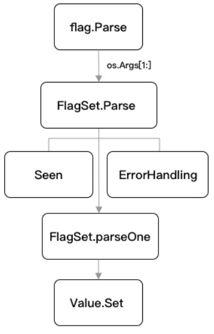

# 命令行工具

## 1.1 打开工具之旅



`flag.Parse`方法，它总是在所有命令行参数注册的最后进行调用，函数功能是解析并绑定命令行参数

`FlagSet.Parse`，其主要承担了 parse 方法的异常分流处理

最后会流转到命令行解析的核心方法 `FlagSet.parseOne` 下进行处理

flag的命令行参数类型是可以自定义的，也就是Value.Set方法，只需要实现其对应的Value相关的两个接口就可以了

```
type Value interface {
	String() string
	Set(string) error
}
```

### 小结

基于第三方开源库 Cobra 和标准库 strings、unicode 实现了多种模式的单词转换，非常简单，也是在日常的工作中较实用的一环，因为我们经常会需要对输入、输出数据进行各类型的转换和拼装。

## 1.4 SQL语句到结构体的转换

在项目初始化或添加新数据表时，我们常常需要添加模型（Model）结构，这时就会遇到一个新问题，即需要写Model结构体。如果手写则太低效，因此本节实现数据库表到GO结构体的转换


首先访问MySQL数据库中的information_schema数据库，读取了COLUMNS表中对应的所需表的列信息，并基于标准库database/sql和text/template实现了表列信息到Go语言结构体的转换